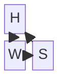

# StatBayesAnalysisChecklist

* Before modeling statistics, you need to think of a scientific causal model first. How are the phenomena of interest related to each other? Which variables "listen" other which others? Draw diagram with arrows.

Height influences weight. Sex influences both height and weight. Weight is influenced by both height and sex.


    

```mermaid

flowchart TD
  %% Force H and W to be on the same (top) row
  subgraph top[""]
    direction LR
    H["H"] --> W["W"]
  end

  %% S below, pointing to both H and W
  S["S"] --> H
  S["S"] --> W

  %% Make nodes look like plain text (no boxes)
  classDef plain fill:transparent,stroke:transparent,color:#000,font-size:32px,font-style:italic;
  class H,W,S plain;

  %% Make all arrows black; make S->W thicker (the 3rd link)
  linkStyle default stroke:#000,stroke-width:2px;
  linkStyle 2 stroke-width:4px;

```

