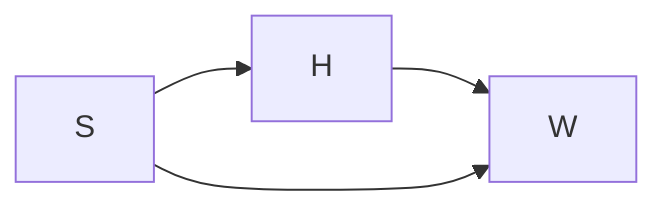
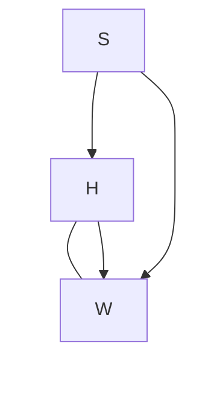

# StatBayesAnalysisChecklist

* Before modeling statistics, you need to think of a scientific causal model first. How are the phenomena of interest related to each other? Which variables "listen" other which others? Draw diagram with arrows.

Height influences weight. Sex influences both height and weight. Weight is influenced by both height and sex.

